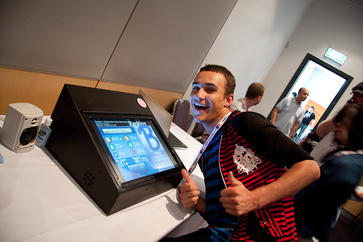

# osu!arcade

The **osu!arcade** was a prototype arcade machine created by ::{ flag=AU }:: [peppy](https://osu.ppy.sh/users/2). It contained custom-made hardware and a built-in touchscreen running a touch-based version of osu!.

## History

### First prototype

::: Infobox

:::

For the [Wai-con](https://en.wikipedia.org/wiki/Wai-Con) anime convention in Perth in January 2010, peppy wanted to create a booth for osu! with the goal to make osu! more known in the local community.[^wai-con] He came up with the spontaneous idea to make an arcade machine, so there were only a few days left until the event to prepare everything. The first prototype was a slanted box with external speakers at the side which used a modified version of osu!(stable) as the game.[^wai-con-video][^kingking9-profile]

Throughout the 2-day convention, peppy tried to get feedback by watching both beginners as well as veterans of [Ouendan](https://en.wikipedia.org/wiki/Osu!_Tatakae!_Ouendan) and [Elite Beat Agents](/wiki/iNiS_games#elite-beat-agents) play the game.

Many convention visitors were attracted by the arcade machine, so much so that at most times it was hard to see the screen due to the constant stream of people gathered around the cabinet. Overall, the community acclaimed the arcade machine, although some people criticised that playing too much could lead to sore fingers.[^sore-fingers]

### Second prototype

::: Infobox

:::

v2 (more beautifully designed box with integrated speakers):

- features:
  - e.g. led lighting controlled by an Arduino microcontroller (led lights flashing according to the music[^music-light])
  - two big audio speakers to the left and right side of the screen
  - see [osu!arcade design documents](https://osu.ppy.sh/community/forums/topics/163062?n=1)
  - peppy: ["It runs both osu!stream and osu!. I named it the osu!arcade as a piece of hardware, not software."](https://osu.ppy.sh/community/forums/topics/163062?n=20)
- work on v2 started around early to mid 2012 apparently (judging from images and videos) [tweet 1](https://twitter.com/ppy/status/212795116774109184) and [tweet 2](https://twitter.com/ppy/status/202271556498505729)
- eventually osu!arcade was not developed further (still seen as a prototype) probably due to the shift to stable and later lazer development
- also creating an osu!arcade is very costly

[local multiplayer support](https://twitter.com/ppy/status/239027656476213249) ([another tweet](https://twitter.com/ppy/status/1380378766778589186))

[Dec 2012 (RFLAN)](https://blog.ppy.sh/post/38114063519/this-week-in-osu-5): adding experimental support for conversion of osu! maps to osu!stream

## References

[^wai-con]: [osu!arcade at Wai-con 2010](https://osu.ppy.sh/community/forums/topics/23392?n=1)
[^wai-con-video]: [osu! at Waicon 2010 (YouTube)](https://www.youtube.com/watch?v=WKvm975bmj0)
[^kingking9-profile]: [kingking9's osu! profile featuring lots of pictures of the prototype](https://osu.ppy.sh/users/1277097)
[^sore-fingers]: [Tweet by @ppy (DATE)](https://twitter.com/ppy/status/17689427400)

[^music-light]: [osu!arcade lighting #2 (wip)](https://www.youtube.com/watch?v=CjXqPZXbnHU)

### Other

- [other link](https://noether.s-ul.eu/3B2GKCqW): no widespread production and arcade necessary features like a coin slot were never added

osu!stream related stuff:

- [osu!stream open mapping](https://osu.ppy.sh/community/forums/topics/91277?n=1) --> see also post 42 by dakeyrus
- [osu!stream mapping guide](https://docs.google.com/document/d/1FYmHhRX-onR-osgTS6uHSOZuu_0JEbfRZePVySvvr9g/edit?hl=en_US&authkey=CL-Pq4EH&tab=t.0)

Gameplay visualisation:

- [osu!arcade with a straw](https://www.youtube.com/watch?v=RyyBXYmBv04)
- [osu!arcade streams are definitely possible](https://www.youtube.com/watch?v=CJb5glKtJJM)
- [[osu!stream/osu!arcade] OK Go - This Too Shall Pass](https://www.youtube.com/watch?v=LQjYwpDnBec)
- [osu!arcade @ RFLAN (highlights #1)](https://www.youtube.com/watch?v=3RZ0e5QxUj8)
- [osu!arcade (multiplayer, various songs)](https://www.youtube.com/watch?v=0idZe5I_YjI)
- [osu!arcade @ OneUp Microcinema](https://www.youtube.com/watch?v=aIDqzD09Sus)

comments with information

- [#1](https://www.youtube.com/watch?v=LQjYwpDnBec&lc=Ugz7J0_hFd-DXQHN5Gl4AaABAg): the touchscreen was a precise optical-based system
- [#2](https://www.youtube.com/watch?v=RyyBXYmBv04&lc=UgwyuGjdPhOk5pLZVKd4AaABAg.A9p6IFliakHA9pB9R-xy4v): The arcade prototype was showcased to the public at multiple events.
- [#3](https://www.youtube.com/watch?v=LQjYwpDnBec&lc=UgyqSDvx465RZdZqSE14AaABAg): one arcade machine is estimated to cost at least 5,000 USD
