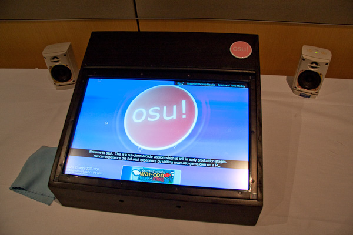

# 2010

- https://osu.ppy.sh/community/forums/topics/15?n=1144

## Excluded on purpose

- [April Fools' jokes](https://osu.ppy.sh/community/forums/topics/27616?n=1)
- [mat promotions](https://osu.ppy.sh/community/forums/topics/36870?n=1)
- [puush](https://osu.ppy.sh/community/forums/topics/32099?n=1)

## January

- [osu!arcade booth at Wai-con 2010](https://osu.ppy.sh/community/forums/topics/23392?n=1)
  - osu! as arcade machine plan in general? --> 2014 ([peppy once tweeted about it](https://nitter.net/ppy/status/1380378232713699330))

On the [Wai-con](https://en.wikipedia.org/wiki/Wai-Con) anime convention in Perth, osu! had an osu!arcade booth which featured a fully self-contained arcade machine running a special version of osu! on it. Although playing too much on it could lead to sore fingers, the prototype containing custom-made hardware and a built-in touchscreen was well-received by the community.[^wai-con]

## February

- [design challenge](https://osu.ppy.sh/community/forums/topics/24356?n=1)

A new osu! update made small improvements in the overall user interface and added the ability to move all storyboard events by an arbitrary time value, allowing for more fine-tuned storyboard animations. In addition to this, usernames became clickable in chat logs.[^stable-b1460]

## March

- [osu! Public Release b1485](https://osu.ppy.sh/community/forums/topics/25978?n=1)
- [art challenge voting?](https://osu.ppy.sh/community/forums/topics/27112?n=1)

Through February and March, [peppy](https://osu.ppy.sh/users/2) organised an art competition about drawing banners for in-game challenges. After a [community voting](https://osu.ppy.sh/community/forums/topics/27112?n=1) concluded, the osu! team picked the final selection. The winner's art being officially used as well as one year of [osu!supporter](/wiki/osu!supporter) or physical goods being awarded were in prospect for the competition's finalist.[^art-challenge]

On March 8, an osu! update brought mainly performance and audio improvements to the game.[^stable-b1485]

## April

- [IRC moved to new domain](https://osu.ppy.sh/community/forums/topics/27635?n=1)
- [osu! Public Release b1596](https://osu.ppy.sh/community/forums/topics/28863?n=1)

Due to infrastructure changes, the [IRC](https://en.wikipedia.org/wiki/Internet_Relay_Chat) was moved to the address `irc.ppy.sh`.[^irc]

This month, peppy introduced a new star rating difficulty algorithm in an osu! update.[^stable-b1596]

## August

- [Bancho !report command](https://osu.ppy.sh/community/forums/topics/34843?n=1)
- [Changing Usernames](https://osu.ppy.sh/community/forums/topics/34694?n=1)
- [nardii gave peppy access to @osugame?](https://osu.ppy.sh/community/forums/topics/17399?n=10)

Since August 2, users were able to change their username once. One requirement was that they had to have an active<!--not sure if this was also like it is today--> osu!supporter tag.[^name-change]

[Bancho](wiki/de/BanchoBot) received the [`!report`](/wiki/de/BanchoBot#report) command, allowing people to notify chat moderators of users that show unsolicited behaviour (e.g. spamming in chat).[^bancho-report]

[nardii](https://osu.ppy.sh/users/1017) gave peppy access to their [Twitter](https://twitter.com) account [@osugame](https://twitter.com/osugame) which was used for general osu! news from then on.[^twitter-osugame]

## September

- [osu! Public Release b1650](https://osu.ppy.sh/community/forums/topics/36635?n=1)
  - mapping updates
- [taiko score reset](https://osu.ppy.sh/community/forums/topics/37672?n=1)

## October

- [flashlight mod deactivated](https://osu.ppy.sh/community/forums/topics/38692?n=1)
- [flashlight is back](https://osu.ppy.sh/community/forums/topics/38760?n=1)
  - see trivia section in [flashlight article](https://osu.ppy.sh/wiki/en/Gameplay/Game_modifier/Flashlight#trivia)
- [mat members can bubble beatmaps](https://osu.ppy.sh/community/forums/topics/38405?n=1)

## November

- [flashlight disabled again](https://osu.ppy.sh/community/forums/topics/41039?n=1)
- [osu! Public Release b1696](https://osu.ppy.sh/community/forums/topics/41318?n=1)
  - new sprites for taiko
- [flashlight is back (again)](https://osu.ppy.sh/community/forums/topics/41519?n=1)

## References

[^wai-con]: [Forum thread by peppy (2010-01-27) "osu!arcade at Wai-con 2010"](https://osu.ppy.sh/community/forums/topics/23392?n=1)

[^art-challenge]: [Forum thread by peppy (2010-02-12) "Competition: Designing challenge artwork!"](https://osu.ppy.sh/community/forums/topics/24356?n=1)
[^stable-b1460]: [Forum thread by peppy (2010-02-23) "osu! Public Release b1460"](https://osu.ppy.sh/community/forums/topics/25142?n=1)

[^stable-b1485]: [Forum thread by peppy (2010-03-08) "osu! Public Release b1485"](https://osu.ppy.sh/community/forums/topics/25978?n=1)

[^irc]: [Forum thread by peppy (2010-04-02) "osu! Public Release b1553 / new Bancho server"](https://osu.ppy.sh/community/forums/topics/27635?n=1)

[^stable-b1596]: [Forum thread by peppy (2010-04-21) "osu! Public Release b1596"](https://osu.ppy.sh/community/forums/topics/28863?n=1)

[^name-change]: [Forum thread by peppy (2010-08-02) "Changing Usernames"](https://osu.ppy.sh/community/forums/topics/34694?n=1)
[^bancho-report]: [Forum thread by peppy (2010-08-05) "Bancho !report command"](https://osu.ppy.sh/community/forums/topics/34843?n=1)
[^twitter-osugame]: [Forum post by peppy (2010-08-21)](https://osu.ppy.sh/community/forums/topics/17399?n=10)
